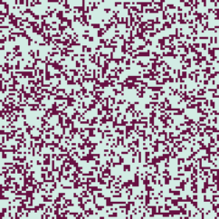
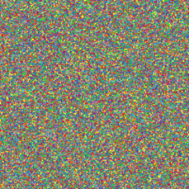
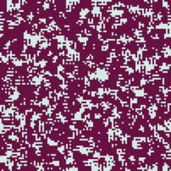

# Exercise guide: CA

UNCuyo - Facultad de Ingeniería - Sistemas Complejos - 2026

Adrián Zangla - 13924

# 1. 

Both chosen automata belong to the Elementary family of 1D Cellular Automata, meaning each cell's next state depends strictly on its current state and its two immediate neighbors.

For both simulations, the initial condition is set by `setup-random` with the `density` slider at 10%.

## Rule 1

Rule 1 determines that a cell becomes active in the next generation only if its previous 3-cell neighborhood was completely inactive. All other neighborhood configurations result in an inactive state. In binary, its rule set is `00000001`:

* 111 → 0, 110 → 0, 101 → 0, 100 → 0, 011 → 0, 010 → 0, 001 → 0, 000 → 1.

The evolution alternates between a dense and a sparse row with a period of 2. Because it settles into a periodic structure rather than dying out completely or becoming chaotic, it belongs to Wolfram Class 2.

*Spacetime plot of Rule 1: each row is one generation of the grid, with time running downward.*

## Rule 120

In binary, its rule set is `01111000`. This dictates the outcome for all 8 possible 3-cell neighborhood configurations:

* 111 → 0, 110 → 1, 101 → 1, 100 → 1, 011 → 1, 010 → 0, 001 → 0, 000 → 0.

Starting from a random initial row, the evolution generates a continuously chaotic, non-repeating pattern that drifts to the right across the grid over time. Because it produces persistent, pseudo-random chaotic behavior that neither stabilizes nor dies out, it belongs to Wolfram Class 3.

*Spacetime plot of Rule 120 over the first 512 generations, shown in four consecutive panels (ticks 0-128, 128-256, 256-384, 384-512).*

# 2.

The two models chosen are Life and Cyclic CA, from Sample Models → Computer Science → Cellular Automata.

## a)

Life is Conway's Game of Life: a 2-state CA on a square grid with a Moore neighborhood (8 neighbors). Its rule is B3/S23. In the `go` procedure, the update reads:

* `ifelse live-neighbors = 3 [ cell-birth ] [ if live-neighbors != 2 [ cell-death ] ]`

A dead cell is born with exactly 3 live neighbors; an alive cell survives with 2 or 3 and dies otherwise.

Cyclic CA gives each cell one of `num-states` colors, and updates it to the next color in the cycle if at least `threshold` neighbors already hold that next color. The update runs on a snapshot (`init-pos`) so all cells change in lockstep, and the neighborhood is Moore or von Neumann with radius 1 to 6. The rule is:

* `if count (my-neighborhood with [init-pos = my-next-pos]) >= threshold [ set pcolor (item my-next-pos color-list) ]`

The runs below use the "diamond spirals" preset: radius 1, threshold 1, 14 states, von Neumann neighborhood.

## b)

Before running, I expected Life's random soup (35% initial density) to thin out and relax into stable or blinking local shapes without any global ordering, and Cyclic CA's colored noise to organize into waves that propagate outward and roll up into spiraling diamonds.

## c)

The default boundary conditions are periodic, so patterns wrap around the edges. Enlarging the universe from 201 × 201 to 402 × 402 patches did not change the qualitative result in either model: Life still settles into static shapes and blinkers, and Cyclic CA still forms spiraling diamonds. A larger universe only fits more of the same structures into it; the periodic wrapping does not introduce new behavior.

*Animation of the Life grid evolving over time.*

*Animation of the Cyclic CA grid evolving over time.*

## d)

Different random initial instances give different arrangements but the same qualitative behavior. In Life the transient and the positions of the frozen structures change, but the outcome is always a mix of static shapes and blinkers, reached after thousands of ticks. In Cyclic CA the spirals nucleate at different places and in different numbers, but they always form.

## e)

In Life's `go` procedure I changed one condition:

* `ifelse live-neighbors = 3` → `ifelse live-neighbors <= 3`

Because the `else` branch still kills every cell with more than the threshold of neighbors, the edit turns B3/S23 into B0123/S0123: a cell is alive at the next tick if it has at most 3 live neighbors, and dies otherwise. The result is global strobing: nearly every cell flips on every tick, until the grid settles into small shapes that oscillate between being alive on a dead background and being dead on an alive background, never coming to rest.

*Animation of the edited rule's grid evolving over time.*
